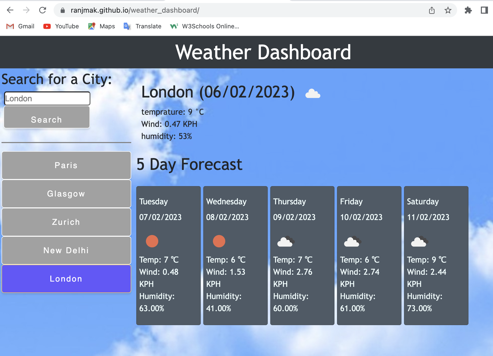

# weather_dashboard
a dashboard showing a 5 day weather forecast for a user searched city. the city value is then made persistent via local storage to save time in the future

## the Task

Using the [5 Day Weather Forecast](https://openweathermap.org/forecast5) to retrieve weather data for cities. The link guides you on how to use the 5 Day Forecast API.

The base URL for the API calls look like the following: 
`https://api.openweathermap.org/geo/1.0/direct?q={cityName}&appID={API Key}` - this is used to first get the latitude & longitude coordinates given a city name

`https://api.openweathermap.org/data/2.5/forecast?lat={lat}&lon={lon}&appid={API key}` - the latitude & longitude coordinates are then used to get the relevant weather data for the next 5 days


## User Story

```text
AS A traveler
I WANT to see the weather outlook for multiple cities
SO THAT I can plan a trip accordingly
```

## Acceptance Criteria

* Create a weather dashboard with form inputs.
  * When a user searches for a city they are presented with current and future conditions for that city and that city is added to the search history
  * When a user views the current weather conditions for that city they are presented with:
    * The city name
    * The date
    * An icon representation of weather conditions
    * The temperature
    * The humidity
    * The wind speed
  * When a user view future weather conditions for that city they are presented with a 5-day forecast that displays:
    * The date
    * An icon representation of weather conditions
    * The temperature
    * The humidity
  * When a user click on a city in the search history they are again presented with current and future conditions for that city

## screenshot

The following image shows the web application's appearance and functionality:



## notes
due to the asynchronous nature of calling server api's, there is a need to not wait allow the page to render. As the code is making two API calls where the second call is reliant on the latitude & longitude coordinates returned from the initial call, some of the code logic needs to wait until the relevant data is returned. This changes the program flow a lot! comments are used throughout to explain the logic to help future readers.